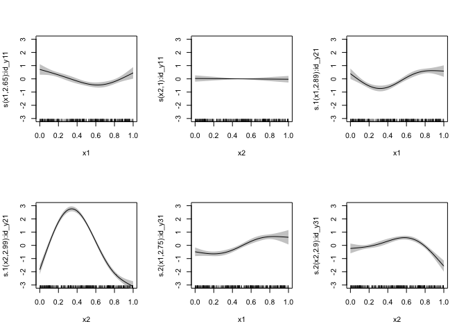

Fitting multivariate outcome GAMs with missing outcome data
================
Noam Ross
2024-01-16

OK, I want to fit a model that has multiple continuous, correlated
outcomes as a multivariate normal using `mgcv::mvn`. However, data from
some of the outcomes are missing. This doc is an exploration of
approaches for this.

First let’s generate some data. In this case make a data framewith two
input (x) variables and 3 output (y) varibales, with y3 missing 90% of
values. My data simulation function creates some random nonlinear
functions with `approxfun()` and a random covariance matrix for the
outcome. These can be retrieved as attributes of the data later.

<details>
<summary>
(Hidden here are some data simulation functions)
</summary>

``` r
# Generate a dataset with missing values from a multivariate normal distribution
# @param n number of observations
# @param nx number of x variables
# @param ny number of outcome variables
# @param shared_fns number of functions to share across outcome variables, up to nx (not used yet)
# @param x_range range of x values
# @param yrange range of y values
# @param k number of knots for each function
# @param coef_mat matrix of coefficients for each function, typically 1 or zero
# @param miss proportion of missing values for each outcome variable
# @param V covariance matrix for the outcome variables
# @param seed random seed
simulate_mvn_missing <- function(n = 300, nx = 2, ny = 3, x_range = c(0,1), yrange = c(0,1), k = 4,
                                 coef_mat = matrix(1, nx, ny), miss = c(0, 0, 0.2), shared_fns = 1,
                                 V = generate_cov_matrix(ny, scale = 1), seed = 0) {

  # Generate a series of nonlinear functions
  set.seed(seed)
  fns <- replicate(nx*ny, {
    x <- c(x_range[1], runif(k - 2, x_range[1], x_range[2]), x_range[2])
    y <- runif(1) + runif(1)*x + runif(k, yrange[1], yrange[2])
    splinefun(x = x, y = y, method = "fmm")
  })
  dim(fns) <- c(ny, nx)

  # Random X values
  x <- matrix(0, n, nx)
  set.seed(seed)
  for (i in seq_len(nx)) {
    x[,i] <- runif(n, x_range[1], x_range[2])
  }
  colnames(x) <- paste0("x", seq_len(nx))

  # Generate Y values
  y <- matrix(0,n,ny)
  for (i in seq_len(ny)) {
    for (j in seq_len(nx)) {
      y[,i] <- y[,i] + fns[i,j][[1]](x[,j])
    }

  }
  y <- y + mgcv::rmvn(n, mu = rep(0, ny), V = V)
  colnames(y) <- paste0("y", seq_len(ny))

  # Missing data
  y_miss <- y
  set.seed(seed)
  for (i in seq_len(ny)) {
    y_miss[sample(n, floor(n * miss[i])), i] <- NA
  }

  df <- as.data.frame(cbind(x, y_miss))
  attr(df, "true_V") <- V
  attr(df, "true_fns") <- fns
  attr(df, "true_data") <- as.data.frame(cbind(x, y))
  df
}

generate_cov_matrix <- function(dim, scale = 1) {
  U <- matrix(rnorm(dim^2), dim, dim)
  U[lower.tri(U)] <- 0

  # Ensure diagonal elements are positive
  diag(U) <- abs(diag(U)) + 1e-6  # Adding a small constant for numerical stability

  # Construct the covariance matrix
  covMatrix <- U %*% t(U) * scale
  return(covMatrix)
}
```

</details>

``` r
data <- simulate_mvn_missing(n = 300, miss = c(0,0,0.9), seed = 10, V = matrix(c(1,2,2,2,1,2,2,2,1), 3))
```

OK, first strategy. Following the approach in `?mgcv::missing.data`, we
create new index variables that indicate whether the outcome is missing
as an ordered factor, and use `by=` in smooth terms. In this case I also
center the outcome variables so we don’t have to deal with intercepts.

``` r
xvars <- c("x1", "x2")
yvars = c("y1", "y2", "y3")
data_missing <- data  # The data we'll fit
data_full <- attr(data, "true_data")


ymeans <- numeric(length(yvars))
idvars <- character(length(yvars))
# Make ordered ID variables (0 = missing), center the outcome variables, and set missing values to zero
for (i in seq_along(yvars)) {
  yvar <- yvars[i]
  idvar <- paste0("id_", yvar)
  idvars[i] <- idvar
  # Center the outcome variables so we don't deal with intercepts, save the means
  ymeans[i] <- mean(data_missing[[yvar]], na.rm = TRUE)
  data_missing[[yvar]] <- data_missing[[yvar]] - ymeans[i]
  data_full[[yvar]] <- data_full[[yvar]] - ymeans[i]
  # Create indicate variables (id_*)as to whether to include an observation, as ordered factors
  # with 0 being missing and 1 being present
  data_missing[[idvar]] <- ordered(ifelse(is.na(data_missing[[yvar]]), 0, 1), levels = c("0", "1"))
  # Set missing values to zero
  data_missing[[yvar]][is.na(data_missing[[yvar]])] <- 0
}

# Create no-intercept formulas where all terms are conditional on the id value of the outcome
frms <- lapply(seq_along(yvars), function(i) {
  paste0(yvars[i], " ~ 0 + ", paste0("s(", xvars, ", by = ", idvars[i], ", k = 4)", collapse = " + ")) |>
    as.formula()
})

frms
```

    ## [[1]]
    ## y1 ~ 0 + s(x1, by = id_y1, k = 4) + s(x2, by = id_y1, k = 4)
    ## <environment: 0x7fe9f9858fc8>
    ## 
    ## [[2]]
    ## y2 ~ 0 + s(x1, by = id_y2, k = 4) + s(x2, by = id_y2, k = 4)
    ## <environment: 0x7fe9f9861c08>
    ## 
    ## [[3]]
    ## y3 ~ 0 + s(x1, by = id_y3, k = 4) + s(x2, by = id_y3, k = 4)
    ## <environment: 0x7fe9f84a3db8>

``` r
# Create formulas for the full model without missing data or index terms
frms_full <- lapply(seq_along(yvars), function(i) {
  paste0(yvars[i], " ~ 0 + ", paste0("s(", xvars, ", k = 4)", collapse = " + ")) |>
    as.formula()
})

# Model with missing outcomes
mod_miss <- mgcv::gam(
  frms,
  family = mgcv::mvn(d = length(yvars)),
  data = data_missing,
  method = "REML"
)

# Full model
mod_full <- mgcv::gam(
  frms_full,
  family = mgcv::mvn(d = length(yvars)),
  data = data_full,
  method = "REML"
)

# Plot each model
plot(mod_full, pages = 1, shade = TRUE, ylim = c(-3, 3), xlim = c(0, 1))
```

<!-- -->

``` r
plot(mod_miss, pages = 1, shade = TRUE, ylim = c(-3, 3), xlim = c(0, 1))
```

<!-- -->

In `mod_miss`, in this case, the smooths are different than `mod_full` ,
and due to the correlation it makes sense that they are different for
more than just the last two, missing smooths. However, the scale of
uncertainty is the same between the models, Despite having 90% less data
for `y3` in the missing model.

I assume this is because in the current model the missing values are
zero and for the rows with missing data, the zero-intercept model is
very good at estimating a zero value!

But the terms with `by=` seem to have variances estimated as if the had
all the values, rather than the few non-missing values. Is there a way
to let the smooth know that it’s `n` value is 30 rather than 300? This
seems like it might be able to be done by modifying the penalty matrix
somehow.

One option for getting around this could be, instead of replacing the
missing values with zeros, replacing them with random values with the
same variance as the non-missing values. However, this would change the
covariance between the outcomes the model would estimate. (To be fair, I
might be doing this already by replacing them with zeros.). I’m
interested in the covariance as an outcome, In theory I could also
calculate the covariance between the outcomes by doing
`cov(..., "pairwise.complete.obs")` on the response residuals. The model
estimates would still be different, though, and I’m not sure *how* they
would be different.

The other problem, that I’ve not yet addressed: What if I have a shared
term across variables such as `1 + 2 + 3 ~ 0 + s(x4) + s(x5)` in the
model. The best idea I can come up with is to make several terms, each
representing a condition where different combinations of variables are
missing, and then sum them up.
